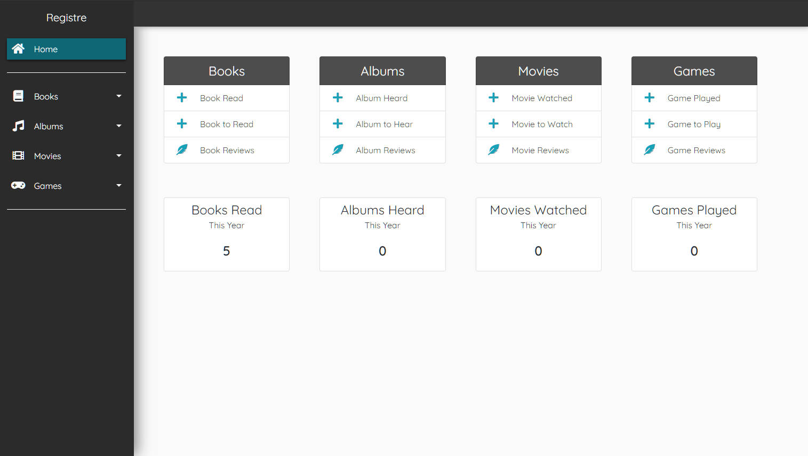
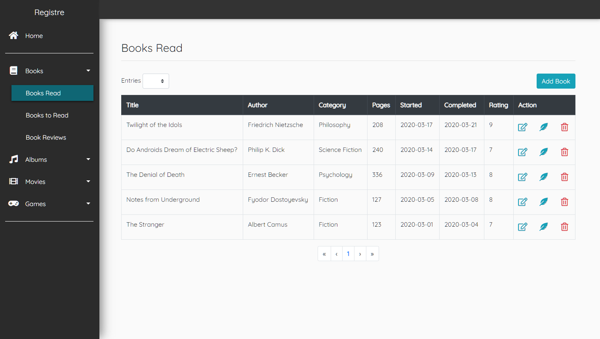
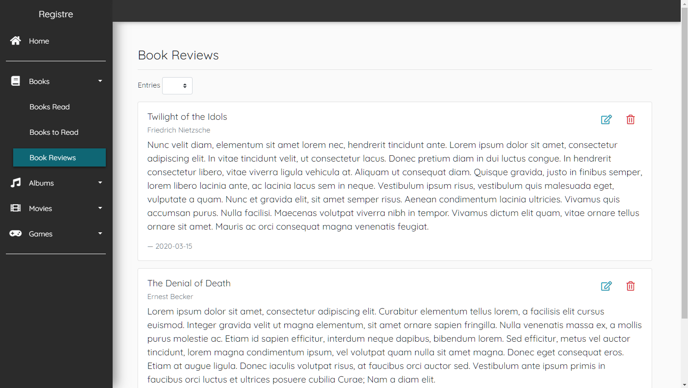
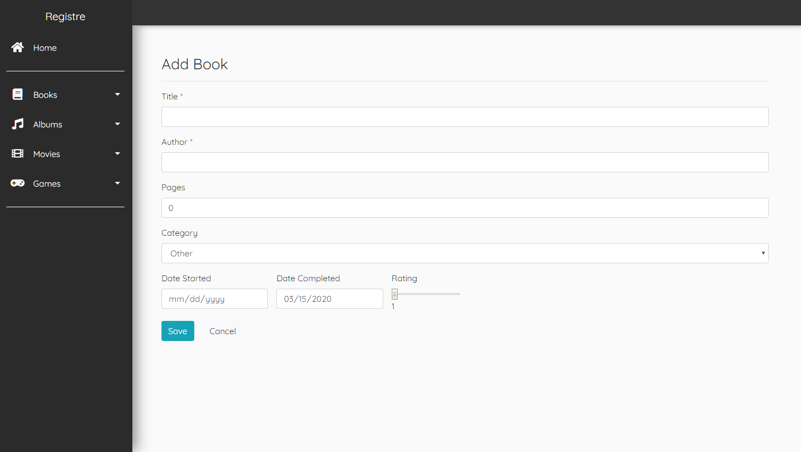

# Registre
[](https://github.com/spring-projects/spring-boot)
[](https://www.thymeleaf.org/index.html)
[](https://hibernate.org/)
[](https://maven.apache.org/)
[](https://www.oracle.com/java/technologies/javase-jdk8-downloads.html)
[](https://www.gnu.org/licenses/gpl-3.0)

Registre is a web application built with Spring Boot for logging completed/uncompleted media. Each medium type has tables for completed and uncompleted media, as well as a section for reviews.

This application supports basic CRUD operations and includes REST APIs for each type of medium. The views were primarily constructed with the use of Bootstrap and Thymeleaf fragments, and Registre unit tests were facilitated by JUnit.

## Technology
* Spring Boot
* Spring Data JPA
* Thymeleaf
* Hibernate
* Bootstrap
* jQuery
* JUnit
* Maven

## Installation
Create a database in MySQL Workbench named *registre*.

```
DROP DATABASE IF EXISTS `registre`;
CREATE DATABASE IF NOT EXISTS `registre`;
```

Create a new user account and connection to the database using the URL, username, and password in the application.properties file.

```
spring.datasource.url=jdbc:mysql://localhost:3306/registre?useSSL=false
spring.datasource.username=registre
spring.datasource.password=admin
```

Download/clone the repository, then run the application.
```
mvnw spring-boot:run
```

## Images





## License
[](https://www.gnu.org/licenses/gpl-3.0)
